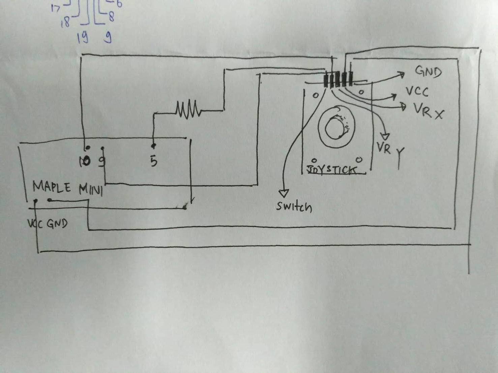

# KEYPAD FOR MAPLE MINI
This code is for joystick testing in Maple Mini using Arduino IDE

## Contributors:
* Faishal Reza Adhitama (16/395393/TK/44685)
* Raka Andinan Pratama (16/395856/TK/44738)
* Resha Dwika Hefni Al-Fahsi (16/394959/TK/44251)
* Vicko Pranowo (16/394966/TK/44258)

## Simulation Video 

## Schematic

